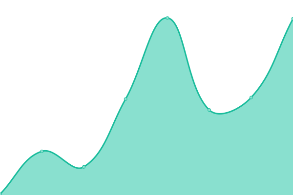
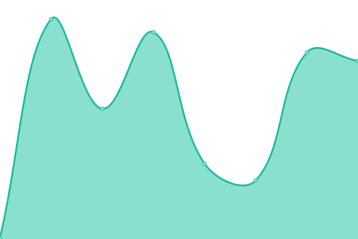
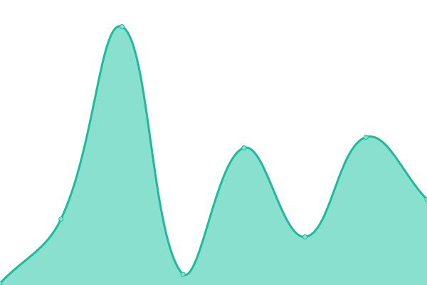

# [📈 Live Status](https://nntin.github.io/status): <!--live status--> **🟧 Partial outage**

This repository contains the open-source uptime monitor and status page for [nntin](https://nntin.xyz/), powered by [Upptime](https://github.com/upptime/upptime).

With [Upptime](https://upptime.js.org), you can get your own unlimited and free uptime monitor and status page, powered entirely by a GitHub repository. We use [Issues](https://github.com/nntin/status/issues) as incident reports, [Actions](https://github.com/nntin/status/actions) as uptime monitors, and [Pages](https://nntin.github.io/status) for the status page.

<!--start: status pages-->
<!-- This summary is generated by Upptime (https://github.com/upptime/upptime) -->
<!-- Do not edit this manually, your changes will be overwritten -->
<!-- prettier-ignore -->
| URL | Status | History | Response Time | Uptime |
| --- | ------ | ------- | ------------- | ------ |
|  [Homepage](https://nntin.xyz) | 🟩 Up | [homepage.yml](https://github.com/NNTin/status/commits/HEAD/history/homepage.yml) | 

 146ms
     
 | 

<a href="https://nntin.github.io/status/history/homepage">100.00%</a>
    

|  [me page](https://nntin.xyz/me) | 🟩 Up | [me-page.yml](https://github.com/NNTin/status/commits/HEAD/history/me-page.yml) | 

 99ms
     
 | 

<a href="https://nntin.github.io/status/history/me-page">100.00%</a>
    

|  [d-zone](https://nntin.xyz/d-zone) | 🟩 Up | [d-zone.yml](https://github.com/NNTin/status/commits/HEAD/history/d-zone.yml) | 

 83ms
     
 | 

<a href="https://nntin.github.io/status/history/d-zone">100.00%</a>
    

|  [hermes](https://hermes.nntin.xyz/) | 🟩 Up | [hermes.yml](https://github.com/NNTin/status/commits/HEAD/history/hermes.yml) | 

 570ms
     
 | 

<a href="https://nntin.github.io/status/history/hermes">100.00%</a>
    

|  [hermes ws](https://hermes.nntin.xyz/dzone) | 🟩 Up | [hermes-ws.yml](https://github.com/NNTin/status/commits/HEAD/history/hermes-ws.yml) | 

 127ms
     
 | 

<a href="https://nntin.github.io/status/history/hermes-ws">100.00%</a>
    

|  [robokellner](https://ws.nntin.xyz/) | 🟩 Up | [robokellner.yml](https://github.com/NNTin/status/commits/HEAD/history/robokellner.yml) | 

 501ms
     
 | 

<a href="https://nntin.github.io/status/history/robokellner">99.67%</a>
    

|  [lanyard](https://api.lanyard.rest/) | 🟩 Up | [lanyard.yml](https://github.com/NNTin/status/commits/HEAD/history/lanyard.yml) | 

 196ms
     
 | 

<a href="https://nntin.github.io/status/history/lanyard">100.00%</a>
    

|  [output badge](https://raw.githubusercontent.com/nntin/me/output/badges/me_first.svg) | 🟩 Up | [output-badge.yml](https://github.com/NNTin/status/commits/HEAD/history/output-badge.yml) | 

 111ms
     
 | 

<a href="https://nntin.github.io/status/history/output-badge">100.00%</a>
    

|  [output repoinfo](https://raw.githubusercontent.com/nntin/me/output/repoInfos.json) | 🟩 Up | [output-repoinfo.yml](https://github.com/NNTin/status/commits/HEAD/history/output-repoinfo.yml) | 

 71ms
     
 | 

<a href="https://nntin.github.io/status/history/output-repoinfo">100.00%</a>
    

|  [output workflow usage](https://raw.githubusercontent.com/nntin/me/output/workflow-usage.csv) | 🟩 Up | [output-workflow-usage.yml](https://github.com/NNTin/status/commits/HEAD/history/output-workflow-usage.yml) | 

 73ms
     
 | 

<a href="https://nntin.github.io/status/history/output-workflow-usage">100.00%</a>
    

|  [voidpet](https://nntin.xyz/voidpet/tierlist) | 🟥 Down | [voidpet.yml](https://github.com/NNTin/status/commits/HEAD/history/voidpet.yml) | 

 93ms
     
 | 

<a href="https://nntin.github.io/status/history/voidpet">100.00%</a>
    

<!--end: status pages-->

[**Visit our status website →**](https://nntin.github.io/status)

## 📄 License

- Powered by: [Upptime](https://github.com/upptime/upptime)
- Code: [MIT](./LICENSE) © [Anand Chowdhary](https://anandchowdhary.com), supported by [Pabio](https://pabio.com)
- Data in the `./history` directory: [Open Database License](https://opendatacommons.org/licenses/odbl/1-0/)
